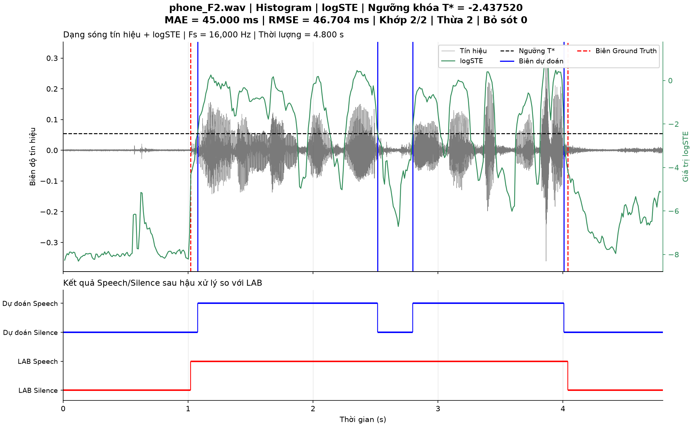
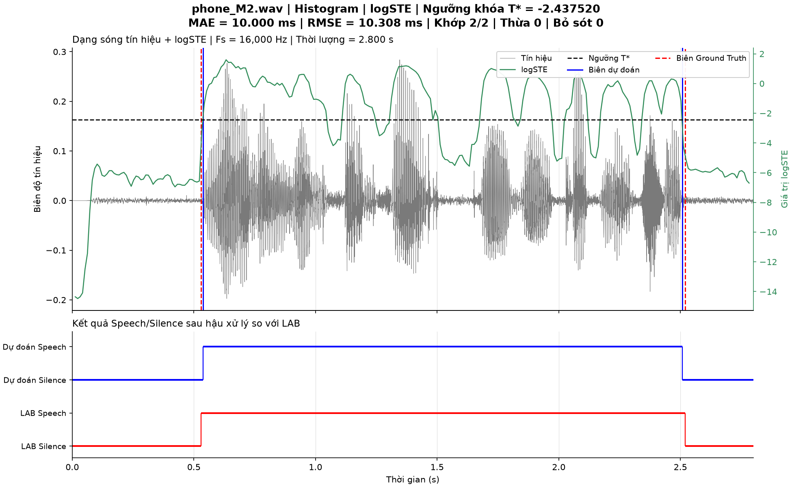
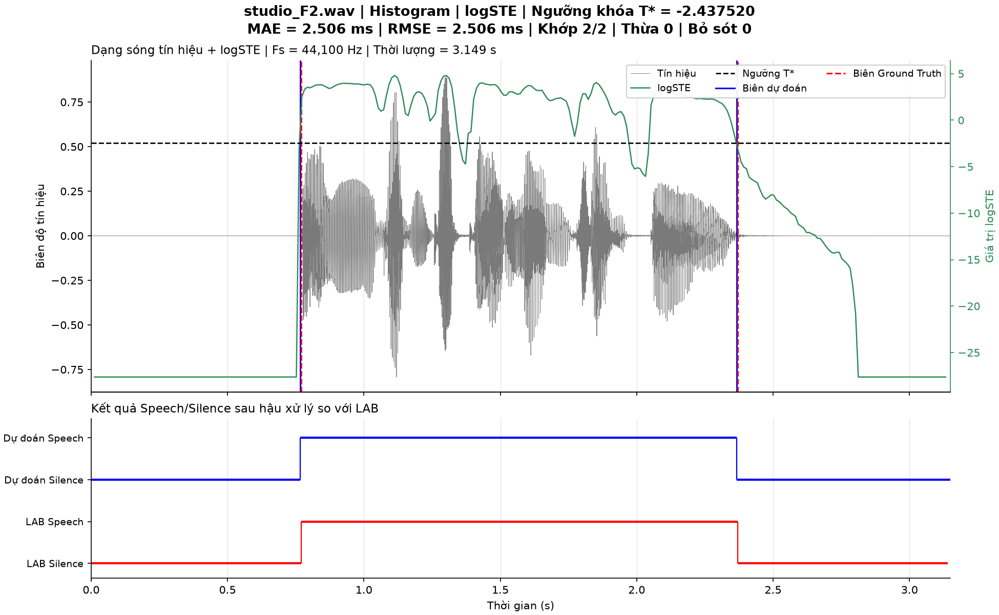
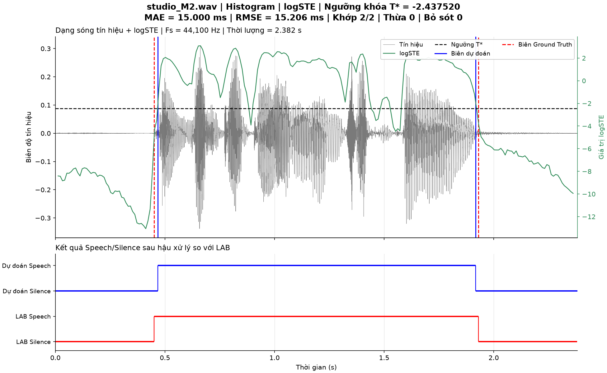

# Step 17: final Histogram Figures

The final run creates exactly one Figure per test WAV: four WAVs produce four
PNG Figures in output/test/figures. Every Figure contains two aligned panels:

1. Waveform and the chosen short-time feature overlaid on the same time panel.
   The left Y-axis shows waveform amplitude; the right Y-axis shows unchanged
   feature values and the exact frozen threshold T*. Predicted boundaries are
   **BLUE** and LAB boundaries are **RED**, with red dashed lines distinguishable
   when predictions closely match LAB. One combined legend describes all traces.
2. Postprocessed Speech/Silence intervals alongside LAB intervals. This panel
   exposes the false silence region in phone_F2 without hiding its two extra boundaries.

Waveform times remain sample index/Fs; feature times remain the supplied frame
centers. The two Y-axes share seconds and the same upper-panel position, while
retaining independent scales. No feature rescaling or time interpolation is used.
Titles, axis labels and legends use Vietnamese labels for the presentation;
the feature label is selected dynamically from STE/MA/logSTE/logMA.

Titles include the filename, feature, threshold, MAE, RMSE and matched/extra/missed
boundary counts. MAE/RMSE describe matched boundary pairs; unavailable errors are
displayed explicitly. Prediction intervals use the existing midpoint boundaries;
LAB gaps/tails are not extended.

All plotting is implemented in src/evaluate/plot.py. main.py delegates the frozen
evaluation and plotting; intermediate Histogram Figures remain in pipeline.ipynb.
The training lock is unchanged: logSTE, 40 bins, smoothing window 1, W=2,
T*=-2.4375196566847372, minimum internal silence 200 ms.

Run from the repository root:

```powershell
python main.py
```

This saves four PNGs and opens the same four final Figure windows. For automatic
verification or a report-only run without windows, use:

```powershell
python main.py --no-show
```

There is one display call after all four Figures have been created, and no
intermediate algorithm windows. Matplotlib is now a regular project dependency.

## Saved Figures

### phone_F2.wav



### phone_M2.wav



### studio_F2.wav



### studio_M2.wav



## Verification

The real-data run produced exactly four PNGs, and all four were visually inspected.
The saved training-lock hash still matches the Step 16 evaluation report.
python -m compileall . and the complete test suite passed. No tests were excluded.

Plot tests check two panels with three Axes (the upper panel includes a right
feature axis), exact boundary positions/colors, unchanged feature and threshold
values, and frame alignment at 16 kHz/44.1 kHz for all four feature choices.
They also check four WAVs producing four Figures, a single optional display call,
no repeated prediction/matching, and stale-report rejection.
